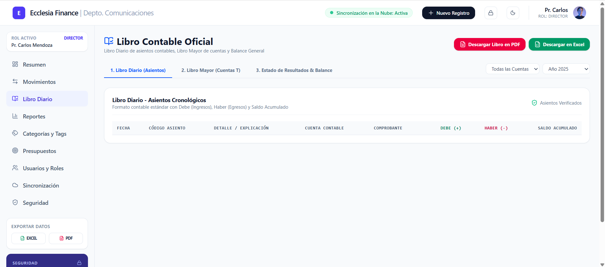
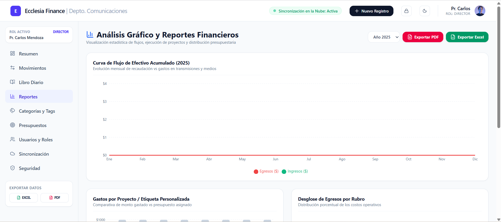

# 📊 Sistema Contable

[](https://opensource.org/licenses/MIT)
[]()

Un sistema de gestión contable diseñado para optimizar el control financiero, manejo de asientos contables, inventario, clientes, proveedores y reportes en tiempo real.

---

## 📸 Capturas de Pantalla (Vista Previa)

<p align="center">
  
  <br>
  <em>Figura 1: Panel principal / Dashboard del Sistema Contable.</em>
</p>

<p align="center">
  
  
  <br>
  <em>Figura 2: Módulo de Asientos Contables y Reportes Financieros.</em>
</p>

---

## ✨ Características Principales

- 📈 **Dashboard Interactivo:** Resumen financiero con indicadores clave en tiempo real.
- 📑 **Libro Diario y Mayor:** Registro de ingresos, egresos y asientos contables automáticos.
- 👥 **Gestión de Clientes y Proveedores:** Registro completo y control de cuentas por cobrar/pagar.
- 📦 **Control de Inventario:** Altas, bajas y seguimiento del kardex de productos.
- 📄 **Generación de Reportes:** Balance general, estado de resultados y reportes exportables en PDF/Excel.
- 🔐 **Control de Acceso:** Autenticación de usuarios con asignación de roles y permisos.

---

## 🛠️ Tecnologías Utilizadas

- **Lenguaje / Framework Principal:** [Específica tu tecnología ej: C# / Node.js / Python / PHP / Java]
- **Base de Datos:** [Ej: PostgreSQL / MySQL / SQL Server]
- **Frontend / Interfaz:** [Ej: React / HTML5 & CSS3 / WPF / Bootstrap]

---

## 🚀 Instalación y Configuración

Sigue estos pasos para clonar e instalar el proyecto localmente:

### 1. Clonar el repositorio
```bash
git clone [https://github.com/Stevencerezo98/Sistema-Contable.git](https://github.com/Stevencerezo98/Sistema-Contable.git) 
cd Sistema-Contable